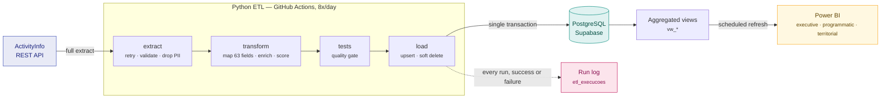

# GBV Indicators Data Pipeline


**An automated data pipeline that turns humanitarian case management records
into decision-ready indicators — and does it eight times a day without anyone
touching it.**

Extracts gender-based violence [GBV] case records from ActivityInfo, transforms
and validates them in Python, loads them into PostgreSQL, and serves a Microsoft
Power BI dashboard. Orchestrated on GitHub Actions: no servers, no recurring
cost, no manual steps.

Built as the technical component of a final project (TCC) for the MBA in Data
Science & Analytics at USP/Esalq, Brazil.

| | |
|---|---|
| **Runtime** | under 5 seconds end to end |
| **Cadence** | 8 scheduled runs per day, plus a manual trigger |
| **Load strategy** | full extract with upsert — idempotent, handles late edits and deletions |
| **Infrastructure cost** | none |
| **PII in the analytical store** | none, by design |

---

## Table of contents

- [The problem](#the-problem)
- [What this project demonstrates](#what-this-project-demonstrates)
- [Architecture](#architecture)
- [How the pipeline works](#how-the-pipeline-works)
- [Data model](#data-model)
- [Data protection](#data-protection)
- [Repository layout](#repository-layout)
- [Running it locally](#running-it-locally)
- [Automation](#automation)
- [Monitoring](#monitoring)
- [A run, end to end](#a-run-end-to-end)
- [Design decisions](#design-decisions)
- [Known limitations](#known-limitations)

---

## The problem

The problem was never a shortage of data. It was latency.

Case records lived in ActivityInfo, a case management platform used across
multiple field locations. Getting from those records to a decision meant exporting
spreadsheets, consolidating them by hand across districts, and circulating a
report — a process measured in days. By the time a report reached management,
the situation it described had often moved on. There was also no way to see
where cases were concentrating geographically, which is precisely the question
that determines where teams and referral pathways should go.

A structured diagnostic with programme and management staff confirmed this and
set the priorities: automated consolidation, a geographic view, and indicators
of data quality itself.

This pipeline is the data layer of the response.

---

## What this project demonstrates

Not a tutorial project. A system in production, built against real constraints:
unreliable field connectivity, a source schema outside my control, sensitive
personal data, no budget, and a user base that will keep using it after I stop
maintaining it.

**Data engineering.** An idempotent ELT pipeline with a raw-to-modelled-to-
aggregated layering, upsert semantics that survive late edits and deletions,
atomic publishing inside a single transaction, and soft deletes that preserve
history.

**Reliability engineering.** Retry with exponential backoff. A volume floor that
turns a silent zero-row success into a loud failure — the failure mode that
actually destroys dashboards. Schema drift surfaced as warnings instead of
silently dropped columns. Every run logged, including the ones that fail.

**Data governance by architecture, not by policy.** Narrative text and names are
discarded at the point of extraction and never reach storage. Emotional state is
computed into a score and thrown away. The visualisation layer can only see
aggregates. The claim is not "we anonymised the data" — it is "the system never
moved identifiable data", and you can verify it by reading one file.

**Engineering judgment.** The [Design decisions](#design-decisions) section
records what was deliberately *not* built and why: no data warehouse, no
orchestrator, no dbt. Choosing the smallest thing that solves the problem is a
design skill, and at this scale the sophisticated alternatives would have been
the wrong answer.

**Analytics.** A weighted composite risk score, operational prioritisation,
referral gap detection, and a per-record data quality index — all derived in the
pipeline so the dashboard stays thin.

**SQL and dimensional modelling.** A normalised case table behind a set of
purpose-built views, so the semantic layer is stable even when the model changes.

---

## Architecture



Every arrow is a pull on a timer. Nothing pushes, nothing streams, and no
component depends on a human being awake.

Orchestration runs on **GitHub Actions**: no server, no container registry, no
recurring cost. The runner is ephemeral — it is created for the run and
destroyed afterwards.

---

## How the pipeline works

### 1. Extract — `etl/extract.py`

Authenticates against the ActivityInfo REST API using HTTP Basic auth and pulls
**every record on every run**. Failures are retried three times with
exponential backoff, which matters because field connectivity is unreliable.

Two validation gates run before anything else happens:

- **Shape check.** If the response is not a list, or none of the expected field
  names are present, the run aborts. This catches a changed form or a wrong
  form ID.
- **Volume floor.** If fewer than 1,000 records come back, the run aborts. This
  is the important one. A pipeline that crashes is visible; a pipeline that
  "succeeds" having silently fetched zero rows because a token expired will
  quietly wipe your dashboard. The floor makes that failure loud.

The extractor also reports any field present in the source that the pipeline
does not know about, so schema drift surfaces as a warning rather than as
silently discarded data.

Sensitive free-text fields are discarded here, at the moment of receipt, before
any transformation, logging or persistence. See
[Data protection](#data-protection).

### 2. Transform — `etl/transform.py`

Maps **63 source fields** onto typed internal names and derives a set of
analytical columns:

| Derived field | What it does |
|---|---|
| `violence_type_short` | Normalises inconsistent spelling and accents into six canonical categories |
| `age_band` | Groups the age field into 10–14, 15–19, 20–24, 25–49, 50+ |
| `technical_risk_score` | Weighted 0–100 score from violence type, age band, immediate safety, emotional state, disability and prior incidents |
| `operational_priority` | Buckets the score into CRÍTICO / ALTO / MÉDIO / BAIXO |
| `possible_service_gap` | Flags rape or sexual assault cases with no medical referral recorded |
| `referral_count`, `referral_types` | Counts and lists which of seven referral services were used |
| `days_to_closure`, `days_since_id` | Case duration and age |
| `is_open_over_90d` | Long-running open cases |
| `data_quality_score` | Percentage of six critical fields populated, per record |
| `case_manager_ref` | Salted SHA-256 pseudonym replacing the case manager's name |

Dates arrive in several formats and one field arrives as epoch milliseconds;
all eleven date fields are normalised.

### 3. Test — `etl/tests.py`

A quality gate between transformation and load, with two severities.

**Hard failures** abort the run before anything is written: a record without a
primary key, or duplicate keys. These indicate the extract is wrong, and
loading would corrupt the table.

**Warnings** are reported and recorded but do not block: records missing
violence type, identification date or district; risk scores outside 0–100;
unexpected priority values; and the count of cases with a referral gap.

The distinction matters. Data quality problems in the source are part of what
this project measures — blocking on them would hide the very thing the
dashboard is meant to expose.

### 4. Load — `etl/load.py`

Everything happens in **one transaction**. If any part fails, the table is left
exactly as it was; the dashboard never reads a half-loaded state.

- **Upsert** on `record_id`. Existing rows are updated in place, new rows are
  inserted.
- **Soft delete.** Records that no longer appear in the source are flagged
  `activo = false` rather than deleted, so history survives.
- **Run logging.** Start time, duration, records extracted, inserted, updated
  and deactivated, mean data quality, and outcome are written to
  `etl_execucoes` — including on failure.

---

## Data model

Deliberately small: two tables and a set of views.

### `public.casos`

One row per case, 76 columns: identifiers, dates, survivor profile, location,
incident characteristics, alleged perpetrator, seven referral pathways, case
management status, displacement status, and the derived analytical fields
above.

Indexed on identification date, district, violence type, case status and the
active flag.

### `public.etl_execucoes`

One row per pipeline run. This table is not infrastructure — it is **evidence**.
One of the project's research objectives is to assess whether the system
improves the timeliness and completeness of information. Without a run log that
can only be asserted; with one it can be measured, and compared against
published results from similar interventions.

### Views

Power BI consumes views, never the base table. Changes to the underlying model
therefore do not break the dashboard.

| View | Contents |
|---|---|
| `vw_casos_vbg` | Valid GBV cases — excludes records triaged as non-GBV and records with no type. All other views build on this one. |
| `vw_casos_mensal` | Monthly counts by violence type, province and district |
| `vw_perfil_sobreviventes` | Age band, sex and violence type |
| `vw_encaminhamentos` | Referral rates across the seven services |
| `vw_territorial` | District-level cases, open cases, referral gaps, mean closure time |
| `vw_qualidade_dados` | Data completeness over time |
| `vw_triagem` | Share of registered records triaged as non-GBV |
| `vw_desempenho_pipeline` | Runs, failures, duration and throughput per day |

---

## Data protection

These are gender-based violence case management records. The architecture
treats confidentiality as a design constraint, not as a policy added
afterwards.

**Narrative text never enters the system.** Incident descriptions, accounts of
what happened, reasons a survivor is unsafe, and safety measures taken are
dropped at extraction — before transformation, before logging, before any
write. Fifteen source fields are on this list.

**Names never enter the system.** The survivor name field and case manager name
fields are on the same exclusion list. The case manager is represented by a
salted hash, which supports workload analysis without storing anybody's
identity. The salt lives in an environment variable; without it the value is
not attributable.

**Emotional state is computed, not stored.** It contributes to the risk score
and is then discarded. Only the resulting number persists.

**The dashboard sees aggregates only.** Power BI connects to the `vw_*` views,
never to the case table. No individual row reaches the visualisation layer.

**Secrets live only in environment variables** and GitHub Secrets. This includes
the form identifier, which points at a specific dataset and is therefore treated
as configuration rather than code. The repository is private.

The combined effect is that the system never moves personally identifiable
information — a stronger claim than "the data was anonymised", and one that can
be demonstrated by reading `config.py`.

---

## Repository layout

```
.
├── etl/
│   ├── config.py        Field mapping, excluded fields, thresholds
│   ├── extract.py       API call, retry, validation, sensitive-field drop
│   ├── transform.py     Cleaning, enrichment, scoring, pseudonymisation
│   ├── tests.py         Quality gate
│   ├── load.py          Upsert, soft delete, run logging
│   └── pipeline.py      Orchestrates the four stages
├── .github/workflows/
│   └── pipeline.yml     Schedule and manual trigger
├── .env.example         Template for local configuration
├── requirements.txt
└── README.md
```

Three files, three responsibilities, one orchestrator. Each stage can be tested
on its own, and the transformation can be re-run without touching the API.

---

## Running it locally

Requires Python 3.11 or later.

```bash
cp .env.example .env          # fill in the four values
pip install -r requirements.txt
cd etl && python pipeline.py
```

### Configuration

| Variable | What it is |
|---|---|
| `ACTIVITYINFO_TOKEN` | API token for the ActivityInfo account |
| `ACTIVITYINFO_FORM_ID` | ID of the case management form to extract from. Kept out of the code because it points directly at a specific dataset. |
| `DATABASE_URL` | PostgreSQL connection string |
| `PSEUDONYM_SALT` | Long random string used to hash case manager names. Keep it stable — changing it changes every pseudonym. |

### Two things that will bite you

**Use the session pooler, not the direct connection.** Supabase direct
connections (`db.<ref>.supabase.co`) are IPv6-only unless you pay for the IPv4
add-on, and GitHub Actions runners are IPv4-only. Use the session pooler on
port 5432, which is IPv4 and still supports prepared statements:

```
postgresql://postgres.<project-ref>:<password>@aws-<n>-<region>.pooler.supabase.com:5432/postgres
```

Copy it from the **Connect** button in the Supabase dashboard rather than
building it by hand — the username format differs between the two modes.

**URL-encode special characters in the password.** An unencoded `@` splits the
connection string in the wrong place and produces a misleading DNS error.
`@` → `%40`, `#` → `%23`, `/` → `%2F`, `:` → `%3A`, `?` → `%3F`.

---

## Automation

`.github/workflows/pipeline.yml` defines two triggers.

**Scheduled**, eight times a day at two-hour intervals:

```yaml
cron: '30 3,5,7,9,11,13,15,17 * * *'   # UTC — 05:30 to 19:30 local (UTC+2)
```

Eight is not arbitrary: it is the maximum number of scheduled dataset refreshes
allowed on a Power BI Pro licence, and the refreshes are set thirty minutes
after each ETL run. The runs are concentrated in working hours, which caps
worst-case latency at roughly two hours during the day.

**Manual**, through `workflow_dispatch` — a button in the Actions tab. Useful
for testing, and for demonstrating the system live.

Required repository secrets, under Settings → Secrets and variables → Actions:
`ACTIVITYINFO_TOKEN`, `ACTIVITYINFO_FORM_ID`, `DATABASE_URL`, `PSEUDONYM_SALT`.

A typical run completes in under five seconds.

---

## Monitoring

```sql
-- recent runs
select id, accionado_por, estado,
       iniciado_em, duracao_segundos,
       registos_extraidos, registos_inseridos,
       registos_actualizados, qualidade_media
from public.etl_execucoes
order by id desc
limit 20;

-- reliability and throughput by day
select * from public.vw_desempenho_pipeline order by dia desc;
```

GitHub Actions emails on failure. The `estado` column distinguishes `SUCESSO`
from `FALHA`, and failed runs record the exception message — so a failure is
recorded rather than simply absent.

---

## A run, end to end

```
==================================================================
ETL — Indicadores de VBG
Início: 2026-09-07 01:22:07  (github-actions)
==================================================================

Execução #4 registada.

[1/4] Extracção do ActivityInfo...
      2647 registos em 0.2s

[2/4] Transformação e enriquecimento...
      2647 registos em 0.6s

[3/4] Testes de qualidade...
      [aviso] 13 registos sem tipo de violência (0.5%)
      [aviso] 13 registos sem data de identificação (0.5%)
      [aviso] 185 casos com lacuna de encaminhamento médico (7.0%)
      Qualidade média dos dados: 99.6%

[4/4] Carga em PostgreSQL...
      inseridos 0 | actualizados 2647 | inactivados 0  (3.9s)

==================================================================
Concluído em 1.9s
==================================================================
```

Two things worth noticing. `inseridos 0 | actualizados 2647` on a repeat run is
the **idempotency guarantee in evidence** — running the pipeline again changes
nothing it should not change. And the quality warnings are *reported, not
suppressed*: data completeness in the source is one of the things this project
sets out to measure, so hiding it would defeat the purpose.

---

## Design decisions

Recorded here because the reasoning matters more than the choices.

### Full refresh instead of incremental loading

Incremental extraction looks more sophisticated and would be wrong here. In
case management, records are edited *late*: a case opened in March is formally
closed in June, a referral is added weeks after intake. An incremental load
keyed on creation would capture the intake and permanently miss the closure.
Deletions would never propagate at all.

At this volume a full extract takes seconds. Fetching everything and upserting
is correct by construction rather than correct by cleverness. The threshold for
revisiting this is hundreds of thousands of records.

### PostgreSQL instead of a data warehouse

The dataset is a few megabytes. Snowflake, BigQuery and Databricks are built
for terabytes and concurrent query loads, and carry fixed monthly cost and
operational complexity that buy nothing at this scale.

There is a second reason, specific to the sector. A humanitarian solution is
only sustainable if it survives the funding cycle and can be maintained by
whoever comes next. Everything here runs on free tiers and plain Python.

### GitHub Actions instead of an orchestrator

Airflow, Dagster and Prefect solve dependency management across dozens of
interrelated pipelines. This is one job on a timer. Airflow would require a
scheduler, a webserver and a metadata database running permanently to do what a
15-line YAML file does.

Running it on a laptop via cron was also rejected: a decision-support system
that stops working when the analyst closes their laptop contradicts the premise
of the project.

### No dbt

dbt is the industry standard for the transformation layer and would have
provided tests, documentation and a lineage graph. The transformation logic
already existed in validated Python, and porting it to SQL while learning a new
tool was not a good use of the remaining time. The three things dbt would have
given were implemented directly instead. It remains the natural next step.

---

## Known limitations

- **Latency is roughly two hours** during working hours, and longer overnight.
  This is a deliberate trade-off, not real-time streaming. No operational
  decision in this context is taken on an hourly cycle.
- **One source.** A second source — safety audit data collected through
  KoboToolbox — was designed for but could not be collected, for operational
  reasons in the field. The architecture accommodates it; the integration is
  not built.
- **Field mapping is by exact string match**, which is brittle against
  renamed fields in the source form. Unmapped fields are reported as warnings
  rather than failing silently, but they are still dropped until mapped.
- **No automated test suite** beyond the runtime data quality gate. Unit tests
  for the transformation functions are the obvious next addition.

---

## Licence and use

Private repository. The code is the author's own work. The data it processes
is third-party data, accessed under a written agreement for academic purposes,
and is not included in this repository.
